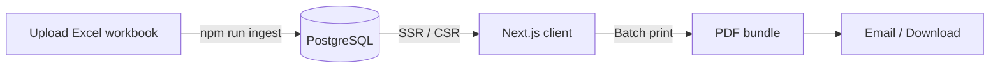

# Suivi de Participation Portal

**Automating the bi‑annual "suivi de participation" for every client in one click**

---

## 📖 TL;DR



1. Drop the latest **Excel workbook** for a client into `data/excel/`.
2. Run `pnpm run ingest` – rows are validated, written to **PostgreSQL**, and audit‑logged.
3. Either:

   * **Admin portal** → click **Export → PDF** and email the file **(Option A)**, **or**
   * Send the client a magic‑link so they browse the live portal themselves **(Option B)**.

Two days of manual Excel → chart → PowerPoint busy‑work are gone.

---

## 1  Problem we solve

> Until now the family office rebuilt 100+ slide decks twice a year.
> Every slide was a screenshot from Excel.
> This repo turns those slides into a living web app that still prints pixel‑perfect PDFs when regulators ask.

---

## 2  Key Features

| Area         | What it does                                                                                                                 | Stack                             |
| ------------ | ---------------------------------------------------------------------------------------------------------------------------- | --------------------------------- |
| Ingestion    | Parses a fixed 11‑column sheet (see §3) starting at row 9, grabs `B1` (Portfolio ID) & `B5` (extraction date), pushes to DB. | `exceljs`, `zod`, **Drizzle ORM** |
| Reporting UI | Exact React clone of the legacy PowerPoint, responsive & brand‑compliant.                                                    | **Next.js 14**, **TailwindCSS**   |
| Auth         | Magic‑link OTP via Supabase; each `user.email` ↔ `portfolio.id`.                                                             | **Supabase Auth**                 |
| Roles        | **admin** (ingest & edit any portfolio) vs. **client** (read‑only own portfolio).                                            | RLS – *TODO*                      |
| Export       | Headless Chromium prints every `/portfolio/[id]` route to PDF with header + footer.                                          | `@puppeteer/core`                 |
| Ops          | CI placeholder; deploys easily to **Vercel + Supabase** or **Docker Compose**.                                               |                                   |

---

## 3  Excel → DB mapping

> **Important**: All numeric values in Excel files must use **French decimal separators** (comma `,`). Example: `123,45` not `123.45`.

| Column (row 9)                        | DB field         | Type          | Example Value |
| ------------------------------------- | ---------------- | ------------- | ------------- |
| **A  Solde**                          | `balance`        | numeric(18,2) | `1 234,56`    |
| **B  Libellé**                        | `label`          | text          | `Actions XYZ` |
| **C  Devise**                         | `currency`       | char(3)       | `EUR`         |
| **D  Estimation + int. courus (EUR)** | `valuation_eur`  | numeric(18,2) | `2 345,67`    |
| **E  Poids (%)**                      | `weight_pct`     | numeric(6,3)  | `12,345`      |
| **F  Code ISIN**                      | `isin`           | char(12)      | `FR0000120073`|
| **G  B / P ‑ Total (EUR)**            | `book_price_eur` | numeric(18,2) | `3 456,78`    |
| **H  Frais (EUR)**                    | `fees_eur`       | numeric(18,2) | `12,34`       |
| **I  Nom**                            | `asset_name`     | text          | `Total SA`    |
| **J  Stratégie**                      | `strategy`       | text          | `Actions`     |
| **K  Poche**                          | `bucket`         | text          | `Core`        |

> **Heads‑up**: the user spec said "A9→H9" but listed 11 columns. We assume **A–K**. Adjust `src/lib/ingest/columns.ts` if your workbook differs.

### Tables

```sql
-- portfolio.csv imported once
CREATE TABLE portfolio (
  id uuid PRIMARY KEY,
  name text,
  client_email text UNIQUE NOT NULL,
  created_at timestamptz default now()
);

-- one row per ISIN per extract date
CREATE TABLE portfolio_data (
  id uuid PRIMARY KEY default gen_random_uuid(),
  portfolio_id uuid references portfolio(id) on delete cascade,
  extract_date date not null,
  -- 11 mapped fields …
  balance numeric(18,2),
  label text,
  currency char(3),
  valuation_eur numeric(18,2),
  weight_pct numeric(6,3),
  isin char(12),
  book_price_eur numeric(18,2),
  fees_eur numeric(18,2),
  asset_name text,
  strategy text,
  bucket text
);
```

*See `docs/db-schema.md` for full ERD.*

---

## 4  Deployment Modes

|               | **Option A – PDF‑only** | **Option B – Live portal (recommended)** |
| ------------- | ----------------------- | ---------------------------------------- |
| Ship time     | \~1 day                 | 3‑5 days (add RLS & auth UI polish)      |
| Client effort | none                    | OTP login (no password)                  |
| Real‑time     | ❌ snapshot              | ✅ instant data                           |
| Attachments   | Heavy e‑mail            | None – link only                         |
| Future UX     | Limited                 | Drill‑down, alerts, etc.                 |

---

## 5  Local Setup

```bash
pnpm i
cp .env.example .env.local   # add Supabase creds, SMTP, etc.
createdb suivi_portal_local  # or 'pnpm supabase start'
pnpm drizzle:migrate         # creates tables
pnpm dev                     # http://localhost:3000
```

### Current env vars

| Key                                     | Required? | Notes                                         |
| --------------------------------------- | --------- | --------------------------------------------- |
| `SUPABASE_URL`                          | ✅         | e.g. `https://xyz.supabase.co`                |
| `SUPABASE_ANON_KEY`                     | ✅         | for client‑side fetches                       |
| `SUPABASE_SERVICE_ROLE_KEY`             | ✅         | used by migrations and ingest script          |
| `SMTP_HOST` / `SMTP_USER` / `SMTP_PASS` | ✅         | to send OTP e‑mails                           |
| `BRAND_FOOTER_PATH`                     | ✅         | path to the PNG/SVG printed on every PDF page |
| *More TBD*                              |           | add in `.env.example` as the project grows    |

---

## 6  Commands

| Script                              | Description                                           |
| ----------------------------------- | ----------------------------------------------------- |
| `npm run ingest [--file foo.xlsx]` | Parse & upsert. Fails loudly on schema mismatch.      |
| `npm run export:pdf`               | Build + headless‑print all routes to `/out/pdf/`.     |
| `npm run test`                     | Jest (placeholder). Add tests under `src/__tests__/`. |

---

## 7  Roles & Security

| Role                 | Permissions                                                | Enforcement |
| -------------------- | ---------------------------------------------------------- | ----------- |
| **admin**            | ‑ Upload Excel                                             |             |
| ‑ Trigger PDF export |                                                            |             |
| ‑ Invite clients     | Controlled by Supabase `role = 'admin'`; RLS policy *TBD*. |             |
| **client**           | ‑ Read‑only access to their own `portfolio_id`             |             |
| ‑ Download PDF       | RLS checks `auth.uid = portfolio.uid_map`.                 |             |

*Supabase Row‑Level‑Security policies to be written in `docs/rls-policies.sql`.*

---

## 8  CI / CD (coming soon)

```txt
name: CI
on:
  push:
    branches: [main]
jobs:
  build-test:
    runs-on: ubuntu-latest
    steps:
    - uses: actions/checkout@v4
    - uses: pnpm/action-setup@v2
    - run: pnpm i
    - run: pnpm test
```

*Full pipeline doc will live in `docs/ci.md`.*

---

## 9  File Layout

```
.
├─ data/excel/                 # incoming workbooks
├─ src/
│  ├─ pages/                   # Next.js routes
│  ├─ components/              # Shared UI
│  ├─ lib/
│  │  ├─ db/                   # Drizzle schema + queries
│  │  └─ ingest/               # Excel parser + validators
│  └─ __tests__/               # Jest specs (empty for now)
├─ scripts/export-pdf.ts       # Puppeteer printer
├─ out/pdf/                    # Generated docs
└─ docs/                       # Sub‑docs (DB, CI, RLS …)
```

---

## 10 Roadmap

* [ ] **Finish RLS** policies & auth middleware.
* [ ] **Add Jest tests** for ingest edge‑cases.
* [ ] **Playwright e2e** for login & PDF export.
* [ ] **CI pipeline** with lint + test + preview deploy.
* [ ] **Alerts** (Slack/email) when a new workbook is ingested.
* [ ] **Multi‑language** (🇫🇷/🇬🇧) toggle.
* [ ] **Drill‑down charts** & benchmark vs. index.

---

## 11 Contributing

1. Fork → branch → code.
2. `pnpm test` must be green.
3. Open a PR – GitHub Actions will comment a preview URL.
4. A maintainer merges & deploys.

---

## 12 License & Contact

Private – Internal Family Office use only. Ask `@dev‑ops` Slack channel for access.

---

*Made with ❤️ & React by the Dev Ops team.*
